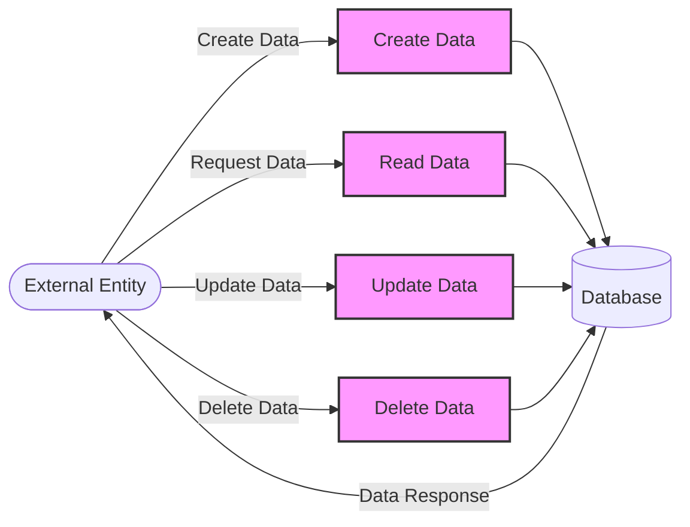

## Module: SmeModelResourceBumiputeraStatus.php
Without the actual code content beyond the class definition, I'll provide an analysis based on the provided class name, its namespace, and the minimal code structure. This analysis will be somewhat speculative but should give a good starting point for understanding the module.

### Module Name
SmeModelResourceBumiputeraStatus.php

### Primary Objectives
This module defines a model in an application, likely a web application using the Laravel PHP framework. Its primary purpose is to represent the Bumiputera status of SMEs (Small and Medium-sized Enterprises) in the application's database. This status is significant in countries like Malaysia, where Bumiputera status can affect business licensing, eligibility for certain benefits, or access to specific programs.

### Critical Functions
Given the minimal code, the primary function of this model is to facilitate interactions with the corresponding `sme_model_resource_bumiputera_status` table in the database. This includes:
- Fetching Bumiputera status records
- Saving new records
- Updating existing records
- Deleting records

### Key Variables
- `$table`: Specifies the name of the table in the database that this model interacts with, which is `sme_model_resource_bumiputera_status`.

### Interdependencies
- **Laravel Framework**: This model relies on Laravel's Eloquent ORM for database interactions.
- **Database**: It directly interacts with the database table named `sme_model_resource_bumiputera_status`.

### Core vs. Auxiliary Operations
- **Core Operations**: Interacting with the database to perform CRUD operations on Bumiputera status records.
- **Auxiliary Operations**: Utilizing the Laravel framework's features, such as soft deletes, accessors, mutators, and relationship mapping, if implemented beyond the provided code.

### Operational Sequence
Typically, the operational sequence in a model like this involves:
1. An instance of the model is created or fetched.
2. The instance is manipulated or updated as required.
3. The instance is saved back to the database, resulting in either an insert or update operation.

### Performance Aspects
Performance considerations include:
- Efficient database queries to minimize response times.
- Proper indexing of the `sme_model_resource_bumiputera_status` table to speed up lookups, especially if the application frequently accesses Bumiputera status records.

### Reusability
The model is designed for a specific purpose but can serve as a template for other models representing different statuses or categories within the application, demonstrating adaptability for reuse with minor modifications.

### Usage
In the application, this model would be used whenever there is a need to interact with the Bumiputera status of SMEs. This could be in administrative dashboards, reporting tools, or in the application's business logic where Bumiputera status affects processing.

### Assumptions
- The database uses a table named `sme_model_resource_bumiputera_status` to store Bumiputera status data.
- The application is built using the Laravel framework, which is suggested by the use of traits like `HasFactory`.
- There is a direct mapping between the application's business logic concerning SME Bumiputera status and the database structure.

This analysis is based on the provided class definition and assumes standard practices of Laravel model usage.
## Flow Diagram [via mermaid]

