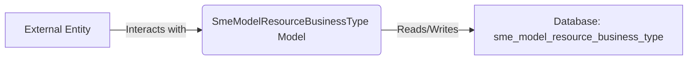

## Module: SmeModelResourceBusinessType.php
Without the specific code content beyond the class definition, I'll provide an analysis based on the provided class skeleton and typical conventions in Laravel projects. The details might be generic and assume standard practices in Laravel model usage.

### Module Name
`SmeModelResourceBusinessType.php`

### Primary Objectives
This module defines a model in a Laravel application. The primary objective is to represent the `sme_model_resource_business_type` table in the database, facilitating interactions such as querying, inserting, updating, and deleting records related to business types in the context of SME (Small and Medium Enterprises) resources.

### Critical Functions
- **`use HasFactory;`**: Enables the use of factories for seeding the database with test data.
  
Since it's a Laravel model, it inherits methods from the `Model` class, such as:
- `find()`
- `create()`
- `update()`
- `delete()`

These methods allow for basic CRUD (Create, Read, Update, Delete) operations.

### Key Variables
- **`protected $table`**: Specifies the custom table name that the model represents, which is `sme_model_resource_business_type` in this case. This is essential for the model to know which table to query in the database.

### Interdependencies
- **Laravel's Eloquent ORM**: This model depends on Laravel's Eloquent ORM for database interactions.
- **Database Migrations**: There should be a corresponding migration file that defines the structure of `sme_model_resource_business_type` table in the database.
- **Factory (optional)**: If used, a factory for generating test data for this model.

### Core vs. Auxiliary Operations
- **Core Operations**: Direct database interactions (CRUD).
- **Auxiliary Operations**: Might include data validation, accessors, mutators, and relationship definitions within the Laravel model that are not directly related to database CRUD operations.

### Operational Sequence
Typically, the sequence involves:
1. Instantiating the model.
2. Performing operations (CRUD) through the model's methods.
3. Optionally, associating the model with others through relationships.

### Performance Aspects
- **Query Optimization**: Utilizing Eloquent relationships and eager loading can minimize the number of queries to the database, enhancing performance.
- **Indexes**: The underlying database table should have appropriate indexes to speed up queries.

### Reusability
- This model can be reused in any part of the Laravel application that requires interaction with the `sme_model_resource_business_type` table. It encapsulates the table structure and behaviors, making it adaptable for various features involving SME business types.

### Usage
Usage involves performing database operations related to SME business types. For example, listing all business types, adding a new type, or updating an existing one.

### Assumptions
- The database table `sme_model_resource_business_type` exists and is correctly structured.
- Laravel's Eloquent ORM is being used for database interactions.
- The application is structured according to MVC architecture, typical in Laravel applications.

This analysis is based on the provided class skeleton and assumes standard Laravel practices. Actual implementation details might vary.
## Flow Diagram [via mermaid]

