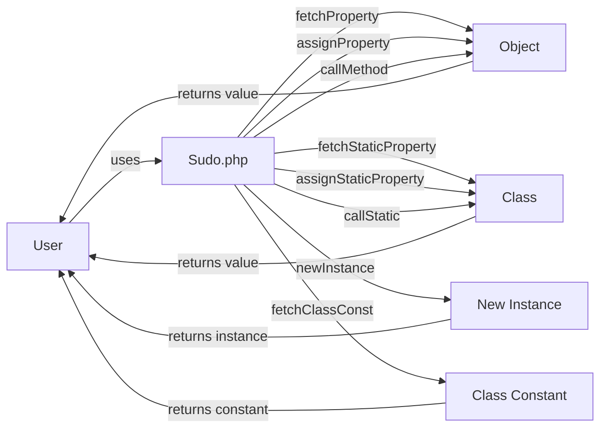

## Module: Sudo.php
Based on the provided code module, here is a comprehensive analysis:

- **Module Name**: Sudo.php

- **Primary Objectives**: The primary purpose of this module is to provide functionality for bypassing visibility restrictions of properties and methods in PHP objects. It is primarily used in code generated by the `sudo` command within the Psy Shell environment, facilitating enhanced debugging and introspection capabilities.

- **Critical Functions**:
  - `fetchProperty`: Fetches the value of a non-public property from an object.
  - `assignProperty`: Sets a value to a non-public property of an object.
  - `callMethod`: Calls a non-public method of an object with provided arguments.
  - `fetchStaticProperty`: Fetches the value of a non-public static property from a class.
  - `assignStaticProperty`: Sets a value to a non-public static property of a class.
  - `callStatic`: Calls a non-public static method on a class with provided arguments.
  - `fetchClassConst`: Retrieves a class constant, bypassing visibility.
  - `newInstance`: Creates a new instance of a class, bypassing private constructors.
  - `getProperty`: Internal method to get a ReflectionProperty instance, handling visibility.

- **Key Variables**: 
  - Not explicitly variable, but the use of `$object`, `$class`, `$property`, `$value`, `$method`, and `$args` as parameters in various methods are key to its functionality.

- **Interdependencies**: 
  - Relies on PHP's Reflection classes (`ReflectionObject`, `ReflectionClass`, `ReflectionMethod`, `ReflectionProperty`) to inspect and manipulate object and class properties and methods.

- **Core vs. Auxiliary Operations**:
  - Core Operations: `fetchProperty`, `assignProperty`, `callMethod`, `fetchStaticProperty`, `assignStaticProperty`, `callStatic`, which directly manipulate object and class members.
  - Auxiliary Operations: `getProperty`, `newInstance`, `fetchClassConst`, which support the core operations or provide additional, but less frequently used functionality.

- **Operational Sequence**:
  - Typically, an object or class, along with a property or method name, is passed to the Sudo class methods, which then use reflection to bypass visibility restrictions and perform the intended operation.

- **Performance Aspects**:
  - Using reflection can significantly impact performance, especially when used in a loop or on a critical path, due to the overhead of introspection and dynamic manipulation.

- **Reusability**:
  - The module is highly reusable in any PHP project that requires manipulation of non-public members for debugging or introspection purposes, provided that its use complies with the legal and ethical guidelines of accessing non-public class members.

- **Usage**:
  - Primarily used within the Psy Shell environment for enhanced debugging. Developers can use it to inspect or modify the state of objects and classes that would otherwise be inaccessible due to visibility restrictions.

- **Assumptions**:
  - Assumes that the user has a legitimate need to access or modify private or protected members of an object or class.
  - Assumes PHP's reflection classes are available and not disabled in the PHP installation being used.
  - Assumes that the performance overhead introduced by reflection is acceptable in the context where it is used.
## Flow Diagram [via mermaid]

