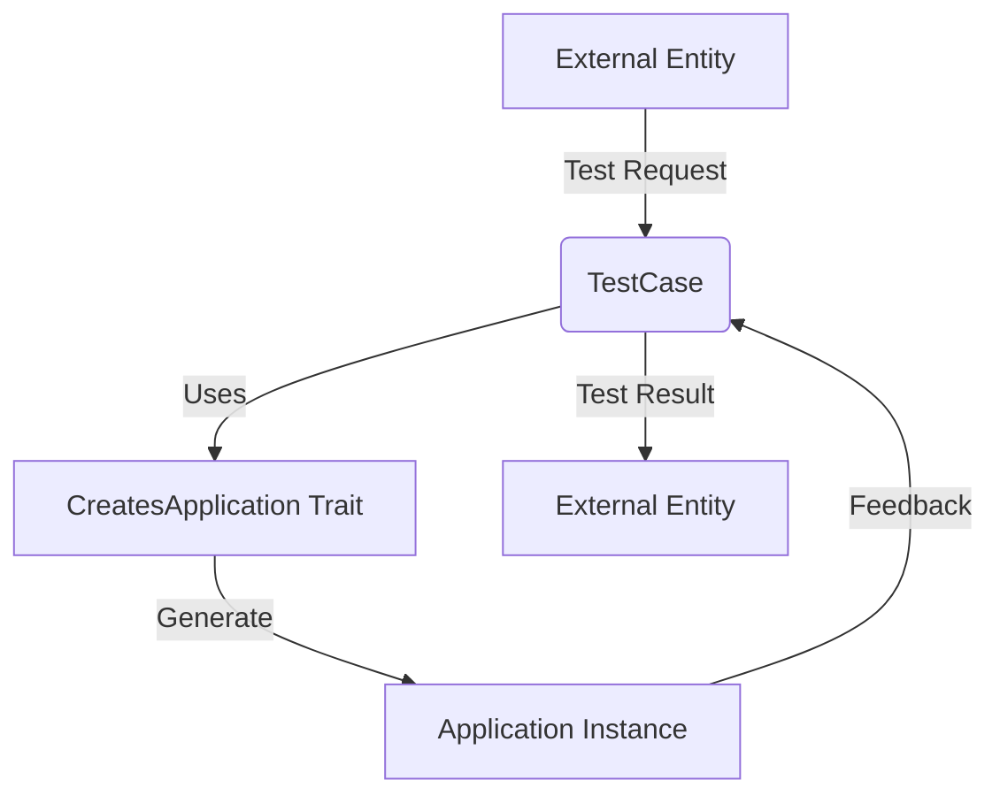

## Module: TestCase.php
Based on the provided code snippet, let's break down the analysis of the `TestCase.php` module within a Laravel project:

### Module Name
- `TestCase.php`

### Primary Objectives
- The primary purpose of `TestCase.php` is to serve as a base class for all test cases within a Laravel application. It extends Laravel's built-in `TestCase` class provided by the `Illuminate\Foundation\Testing` namespace and incorporates the necessary setup for testing, including creating the application instance that tests will run against.

### Critical Functions
- **CreatesApplication Trait**: The `use CreatesApplication;` statement indicates that this class uses a trait named `CreatesApplication`. This trait is responsible for bootstrapping the Laravel application instance required for tests. This is a critical part of the testing setup, allowing tests to interact with a real or mocked Laravel application context.

### Key Variables
- Since the provided code snippet does not define variables within the `TestCase` class itself, the key variable to note is the application instance that would be created and managed by the `CreatesApplication` trait.

### Interdependencies
- **Laravel's Testing Framework**: `TestCase` extends `BaseTestCase` from Laravel's testing framework, relying on its methods and properties to function correctly.
- **CreatesApplication Trait**: It directly depends on the `CreatesApplication` trait for creating the application instance needed for tests.

### Core vs. Auxiliary Operations
- **Core Operations**: Bootstrapping the application for testing.
- **Auxiliary Operations**: While the provided snippet does not show auxiliary operations, typically, these might include setup and teardown operations for database transactions, mocking services, etc.

### Operational Sequence
- When a test case that extends `TestCase` is run, the `CreatesApplication` trait's mechanisms are triggered to bootstrap a Laravel application. This setup is essential for the tests to run within the context of a Laravel application.

### Performance Aspects
- The performance of tests using this module largely depends on how efficiently the application is bootstrapped and how resource-intensive the application and tests are. Minimizing unnecessary service providers or using in-memory databases can enhance performance.

### Reusability
- This module is highly reusable as it serves as a foundation for all test cases. Its adaptability lies in its ability to bootstrap the application for any test, making it a critical component for testing Laravel applications.

### Usage
- `TestCase.php` is used as a base class for all test classes within a Laravel application. Developers extend this class when creating new test cases, leveraging the application setup and testing functionalities it provides.

### Assumptions
- **Laravel Application**: It assumes that it is part of a Laravel application and that the Laravel application structure and testing conventions are being followed.
- **CreatesApplication Trait Exists**: It assumes the existence of the `CreatesApplication` trait and that it is correctly implemented to bootstrap the application.
- **Environment for Testing**: It assumes that the testing environment is correctly configured in the Laravel application, including environment variables, configurations, etc.

This analysis provides a comprehensive overview of the `TestCase.php` module's purpose, functionalities, and usage within the context of Laravel application testing.
## Flow Diagram [via mermaid]

