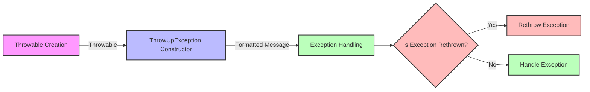

## Module: ThrowUpException.php
Based on the provided code snippet, here's a comprehensive analysis of the `ThrowUpException.php` module:

- **Module Name**: The module is named `ThrowUpException.php`.

- **Primary Objectives**: The primary purpose of this module is to define a custom exception type (`ThrowUpException`) used specifically within the Psy Shell environment. It is designed to throw exceptions that originate within the Psy Shell out to a broader context where they can be handled or reported.

- **Critical Functions**:
    - `__construct(\Throwable $throwable)`: Constructor method that initializes the `ThrowUpException` with a message and code derived from a given `Throwable` object.
    - `getRawMessage()`: Returns an unformatted version of the error message, specifically the message from the previous (`Throwable`) exception.
    - `fromThrowable($throwable)`: Static method intended to create a `ThrowUpException` from a given `Throwable`. This method is deprecated, indicating a shift away from wrapping `Throwable` objects within `ThrowUpException`.

- **Key Variables**: Not explicitly defined in the provided code snippet, but the critical variables include `$message` used in the constructor to format the exception message and the `$throwable` object passed to the constructor and methods.

- **Interdependencies**: This module interacts with PHP's exception handling mechanism by extending the base `Exception` class. It also interacts with any part of the Psy Shell that needs to throw exceptions out of the shell environment.

- **Core vs. Auxiliary Operations**:
    - **Core Operations**: The constructor and `getRawMessage()` method are core to the functionality of the `ThrowUpException`, facilitating its creation and the retrieval of error messages.
    - **Auxiliary Operations**: The `fromThrowable()` method, although deprecated, serves an auxiliary function to provide backward compatibility.

- **Operational Sequence**: The typical flow involves:
    1. An exception occurs within the Psy Shell.
    2. A `ThrowUpException` is instantiated using the original exception (`Throwable`), formatting a new message and preserving the original code.
    3. The `ThrowUpException` can then be thrown, allowing the exception to be handled outside the Psy Shell context.

- **Performance Aspects**: Given its straightforward implementation, the performance impact of using `ThrowUpException` should be minimal. However, the act of throwing exceptions can be costly in PHP if overused, particularly in deep call stacks.

- **Reusability**: The `ThrowUpException` is designed with a specific use case in mind (Psy Shell) but follows good PHP exception practices, making it potentially adaptable for similar use cases where exceptions need to be re-thrown or formatted differently.

- **Usage**: This module is used within the Psy Shell to handle exceptions that need to be thrown out of the shell. It provides a mechanism to format these exceptions consistently and pass them along with their original messages and codes.

- **Assumptions**:
    - The module assumes that exceptions thrown within the Psy Shell need specific handling or formatting before being re-thrown.
    - It assumes that users of the Psy Shell require or benefit from the ability to distinguish exceptions thrown by the shell itself from other exceptions.
    - The deprecation of `fromThrowable()` suggests an assumption that directly wrapping `Throwable` objects is no longer the preferred approach within the Psy Shell context.
## Flow Diagram [via mermaid]

