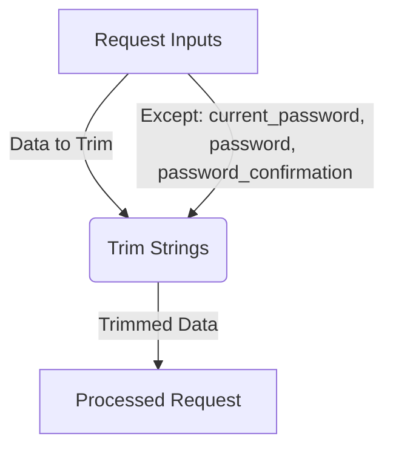

## Module: TrimStrings.php
Based on the provided code snippet for `TrimStrings.php`, here's a comprehensive analysis:

### Module Name
The module is named `TrimStrings`.

### Primary Objectives
The primary purpose of this module is to automatically trim whitespace from all incoming string values in the request data, except for specified attributes. It acts as middleware in a web application, ensuring that user input is sanitized for leading and trailing spaces before reaching the application's core logic.

### Critical Functions
- `__construct`: Although not explicitly defined in the provided snippet, as a subclass of `Illuminate\Foundation\Http\Middleware\TrimStrings`, it inherits a constructor that initializes the middleware.
- Middleware Operations: Inherits methods from its parent `Middleware` class for handling the request and performing the trimming operation on string inputs.

### Key Variables
- `$except`: An array of attribute names that should not be trimmed. This is critical for ensuring that password fields, which may legitimately include leading or trailing spaces, are not altered.

### Interdependencies
- This module extends `Illuminate\Foundation\Http\Middleware\TrimStrings`, meaning it relies on the functionality provided by Laravel's base middleware class for trimming strings.
- It interacts with the HTTP request handling process of a Laravel application, specifically working with incoming request data before it reaches the application controllers.

### Core vs. Auxiliary Operations
**Core Operations**:
- Trimming leading and trailing spaces from incoming string request data.

**Auxiliary Operations**:
- Excluding specific fields (`current_password`, `password`, `password_confirmation`) from the trimming process.

### Operational Sequence
1. The middleware is invoked automatically on incoming requests due to its registration in the application's middleware stack.
2. It checks each string value in the request data against the `$except` array to determine if it should be trimmed.
3. Non-excluded string values are trimmed of leading and trailing whitespace.
4. The request is passed further down the middleware stack/application logic.

### Performance Aspects
- Trimming strings is generally a lightweight operation, but in cases of large requests with many string fields, there could be a noticeable impact on request processing time.
- The efficiency of checking fields against the `$except` array could be a consideration in very high-traffic applications.

### Reusability
- This module is highly reusable in any Laravel-based project requiring automatic trimming of incoming request data, with the flexibility to exclude specific fields from this operation.

### Usage
It is used in Laravel web applications as middleware to sanitize incoming request data, ensuring that extraneous whitespace is removed from string inputs, thereby simplifying validation and processing in subsequent application logic.

### Assumptions
- The module assumes that leading and trailing spaces in string inputs are generally undesired and can be safely removed, except for the fields explicitly listed in the `$except` array.
- It assumes that the application is built with Laravel, given its extension of a Laravel base middleware class.
- There's an implicit assumption that passwords and password confirmations could include spaces as part of their intended value, hence their exclusion from trimming.
## Flow Diagram [via mermaid]

