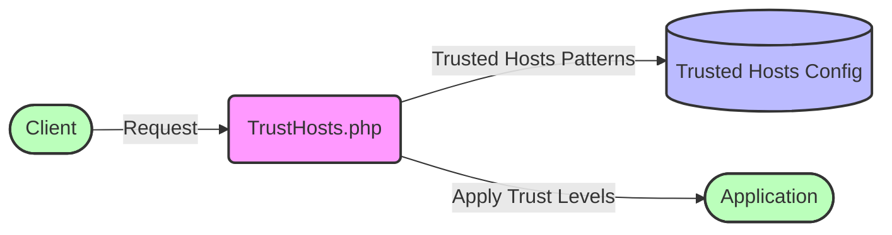

## Module: TrustHosts.php
### Module Name
The module is named `TrustHosts.php`.

### Primary Objectives
The primary objective of this module is to define a set of host patterns that are considered trustworthy within the application context. It is a middleware component that ensures only requests from these trusted hosts are accepted, enhancing the security by preventing HTTP Host header attacks.

### Critical Functions
- **hosts()**: This is the main method of the `TrustHosts` class. Its role is to return an array of host patterns deemed trustworthy. These patterns are used to validate the `Host` header of incoming requests.

### Key Variables
- **No explicit variables are defined outside of methods in the provided code snippet**. However, the method `hosts()` uses `$this->allSubdomainsOfApplicationUrl()`, which suggests there's an inherited or trait-implemented method that generates a pattern matching all subdomains of the application's URL.

### Interdependencies
- **Inheritance from `Illuminate\Http\Middleware\TrustHosts`**: The `TrustHosts` class extends a base middleware class provided by Laravel's `Illuminate` namespace, indicating it relies on functionalities provided by this parent class, such as the method `allSubdomainsOfApplicationUrl()`.

### Core vs. Auxiliary Operations
- **Core Operations**: The core operation of this module is the `hosts()` method, which specifies the trusted hosts.
- **Auxiliary Operations**: While not explicitly shown in the provided code, auxiliary operations might include any inherited methods or properties from the `Middleware` class that support the main functionality, such as methods for handling request validation or processing.

### Operational Sequence
1. When a request is received, the `TrustHosts` middleware is invoked.
2. The `hosts()` method generates a list of trusted host patterns.
3. The request's `Host` header is compared against these patterns.
4. If the `Host` header matches one of the patterns, the request is considered trustworthy and processing continues; otherwise, it might be rejected or further inspected.

### Performance Aspects
- The performance of this module largely depends on the efficiency of the pattern matching for host validation. Since it operates on every request, its impact is minimal but should be optimized for applications expecting high traffic volumes.

### Reusability
- This module is highly reusable in any Laravel application that requires host header validation. Its adaptability lies in the ability to easily modify the list of trusted hosts by overriding or extending the `hosts()` method.

### Usage
- It is used as a middleware in Laravel applications to secure HTTP requests by ensuring they originate from trusted hosts. This is crucial for preventing Host header injection attacks.

### Assumptions
- It assumes that all subdomains of the application's URL are trustworthy.
- It assumes the application is running in an environment where the base URL is correctly configured, as this configuration is essential for generating the subdomains pattern.
- It assumes that the Laravel framework's middleware handling mechanisms are in place and operational, as it is designed to integrate seamlessly with these mechanisms.
## Flow Diagram [via mermaid]

