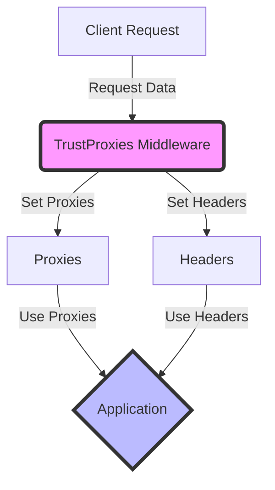

## Module: TrustProxies.php
### Module Name
The module is identified as `TrustProxies.php`.

### Primary Objectives
Its primary purpose is to manage and trust requests that come through proxies. This is essential for applications that are behind load balancers or other proxy servers to ensure that the original request data (like IP addresses and protocols) is accurately captured and trusted.

### Critical Functions
- **Constructor and Middleware Inheritance**: Inherits from Laravel's base middleware class to utilize its foundational features for handling HTTP requests.
- **Proxy Trust Settings**: No explicit methods are defined within this snippet for setting or managing proxies, but it relies on inherited methods and properties to achieve its functionality.

### Key Variables
- `$proxies`: Specifies which proxies are trusted. It can be an array of IP addresses, a single IP address, or `null` (to trust all proxies).
- `$headers`: Defines which headers should be used to detect information forwarded by the proxy, such as the client's IP address and the protocol used.

### Interdependencies
- **Laravel Middleware**: It extends Laravel's middleware functionality, specifically `Illuminate\Http\Middleware\TrustProxies`, to leverage the framework's request handling capabilities.
- **Illuminate\Http\Request**: Uses constants from the `Request` class to specify which headers are used for detecting proxies.

### Core vs. Auxiliary Operations
- **Core Operations**: Trusting proxies and correctly handling forwarded headers to ensure the application can accurately read the original request details.
- **Auxiliary Operations**: None explicitly defined in this snippet, as its focus is narrowly defined.

### Operational Sequence
The operational flow is implicitly defined by the middleware execution process in Laravel:
1. A request is received.
2. The middleware checks if the request comes through a trusted proxy.
3. It then uses the specified headers to retrieve the original request information.

### Performance Aspects
- **Efficiency**: Minimal impact on performance, as it primarily deals with setting and checking configurations.
- **Scalability**: Supports scalable applications by correctly handling requests through proxies, which is common in load-balanced environments.

### Reusability
The class is designed to be reusable within any Laravel application that requires handling requests through proxies. Its configurability (via `$proxies` and `$headers`) enhances its adaptability to different environments.

### Usage
Used in Laravel applications that are deployed behind proxies or load balancers. It is typically registered as middleware within the application's HTTP kernel or middleware stack, ensuring that all incoming requests are processed through it.

### Assumptions
- The application is behind a proxy or load balancer.
- All proxies listed in `$proxies` are secure and trusted.
- The application environment (e.g., load balancers) correctly sets the headers used for detecting the original request details.
## Flow Diagram [via mermaid]

