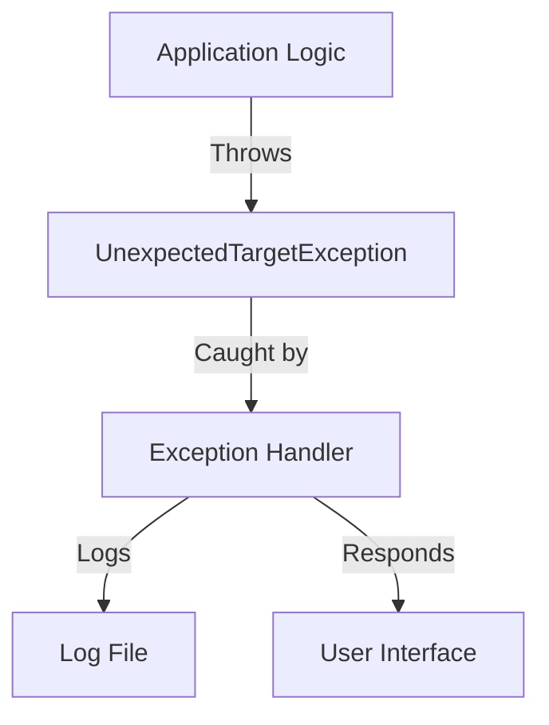

## Module: UnexpectedTargetException.php
**Module Name**: `UnexpectedTargetException.php`

**Primary Objectives**: This module is part of the Psy Shell, a runtime developer console, interactive debugger, and REPL for PHP. The primary purpose of the `UnexpectedTargetException` class is to handle exceptions related to unexpected targets within the Psy Shell environment. This could involve operations or commands that target invalid, unexpected, or inaccessible resources or entities.

**Critical Functions**:
- `__construct($target, string $message = '', int $code = 0, \Throwable $previous = null)`: Constructor method that initializes a new instance of the `UnexpectedTargetException` class. It allows setting the unexpected target that caused the exception, an optional message, an optional code, and an optional previous throwable for exception chaining.
- `getTarget()`: Method to retrieve the target that caused the exception. This allows for further inspection or handling based on the specific cause.

**Key Variables**:
- `$target`: A private variable that holds the reference to the unexpected target which triggered the exception.

**Interdependencies**: This class extends `RuntimeException`, which is a part of PHP's SPL (Standard PHP Library) exception mechanism. It implies that it relies on the built-in exception handling features of PHP and adheres to its conventions for exception classes.

**Core vs. Auxiliary Operations**:
- **Core Operations**: The core operation of this module is encapsulating information about an unexpected target exception, which includes storing the target and providing a mechanism to retrieve it (`getTarget` method).
- **Auxiliary Operations**: The constructor's ability to accept and pass along an optional message, code, and previous throwable to the parent class (`RuntimeException`) can be seen as supporting auxiliary operations that enhance the exception handling capabilities.

**Operational Sequence**:
1. An `UnexpectedTargetException` instance is created when an unexpected target is encountered in the Psy Shell environment.
2. The constructor is called, initializing the instance with details about the unexpected target, and optionally, an error message, code, and previous throwable.
3. The `getTarget` method can be called to fetch the unexpected target for logging, debugging, or other handling purposes.

**Performance Aspects**: Given that exceptions are generally only created and handled in error conditions, the performance impact of this module is minimal under normal operations. However, proper handling of exceptions is crucial to avoid unnecessary performance degradation in error scenarios.

**Reusability**: The `UnexpectedTargetException` class is designed specifically for the Psy Shell environment but follows standard PHP exception handling conventions. While its direct reusability outside Psy Shell might be limited due to its specialized nature, the patterns and practices it uses (extending standard exceptions, encapsulating specific error conditions) are widely applicable in PHP development.

**Usage**: This exception would be used within the Psy Shell to signal and handle errors related to operations targeting unexpected or invalid entities. It helps in debugging and provides a mechanism for gracefully handling error conditions specific to the Psy Shell's interactive environment.

**Assumptions**:
- The module assumes that there is a meaningful way to identify and handle "unexpected targets" within the context of the Psy Shell.
- It assumes that the users of this exception class are familiar with PHP's exception handling mechanisms.
- There's an implicit assumption that the context in which the exception is thrown provides enough information to make the `target` meaningful and actionable.
## Flow Diagram [via mermaid]

