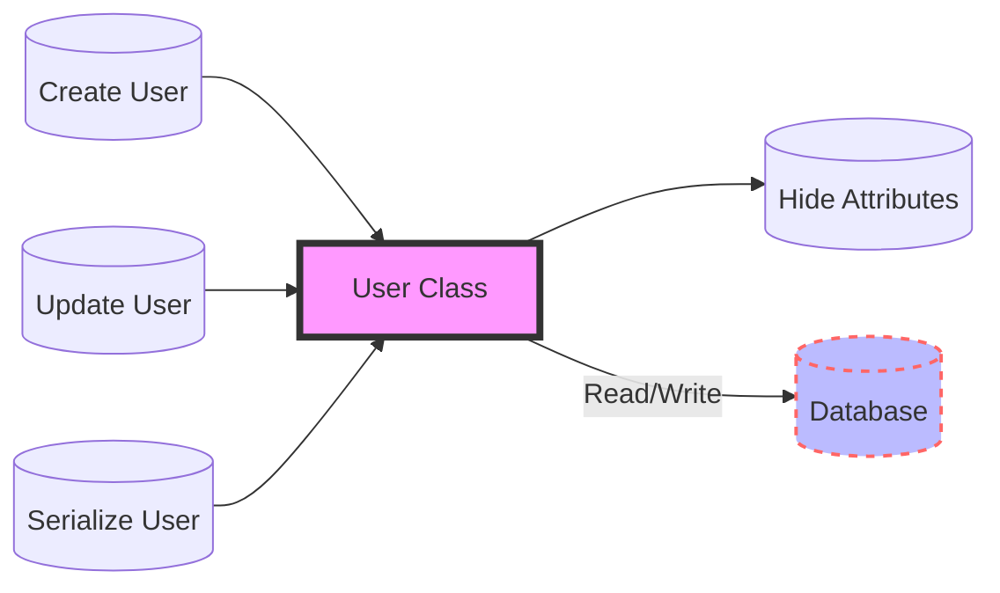

## Module: User.php
Based on the provided code snippet, let's analyze the `User.php` module within the context of a Laravel application.

- **Module Name**: User.php

- **Primary Objectives**: This module is designed to represent the user entity within the application. It extends Laravel's `Authenticatable` class, integrating functionalities essential for authentication and authorization, alongside user management within the application.

- **Critical Functions**:
  - `HasRoles`: Integrates role-based permissions using the Spatie Laravel-permission package, allowing for sophisticated access control mechanisms.
  - `HasApiTokens`: Facilitates API token management for the user, enabling API authentication via Laravel Sanctum.
  - `HasFactory`: Incorporates factory methods for the User model, aiding in the generation of user instances for testing and seeding purposes.
  - `Notifiable`: Enables the user model to send notifications via various channels, enhancing user interaction with the system.

- **Key Variables**:
  - `$guard_name`: Specifies the guard to be used for authentication, set to 'sanctum' for API token authentication.
  - `$fillable`: Defines which attributes can be mass-assigned, crucial for creating or updating instances safely.
  - `$hidden`: Lists attributes that should be hidden from serialization, primarily for security purposes.
  - `$casts`: Dictates how certain attributes should be cast when retrieved from or stored in the database, ensuring data integrity.

- **Interdependencies**: 
  - Relies on Laravel's authentication system, particularly Sanctum for API token handling.
  - Depends on the Spatie permission package for role and permission management functionalities.

- **Core vs. Auxiliary Operations**:
  - Core Operations: User authentication, role and permission management, notification sending.
  - Auxiliary Operations: Data casting, attribute mass-assignment handling.

- **Operational Sequence**: Not explicitly defined in the provided snippet, but typically, user creation or authentication processes would involve this model, followed by role/permission checks or token generation for API access.

- **Performance Aspects**:
  - Efficient handling of user authentication and authorization.
  - Potential performance impact when dealing with large numbers of roles or permissions due to relational database queries.

- **Reusability**: 
  - High. The model is designed with extensibility in mind, allowing for easy addition of methods or traits to extend functionality.
  - The use of traits like `HasRoles` and `HasApiTokens` makes it modular and adaptable to various use cases.

- **Usage**: 
  - This model is a central part of any Laravel application requiring user management, authentication, and authorization functionalities.
  - It interacts with the database to store and retrieve user-related data and with the application logic to enforce access controls.

- **Assumptions**:
  - The application uses Laravel Sanctum for handling API authentication.
  - The Spatie permission package is installed and configured for role-based access control.
  - The application adheres to Laravel's conventions for models, including naming and architectural patterns.

This analysis covers the foundational aspects of the `User.php` module within the context provided, highlighting its role, functionalities, and integration points within a Laravel application.
## Flow Diagram [via mermaid]

