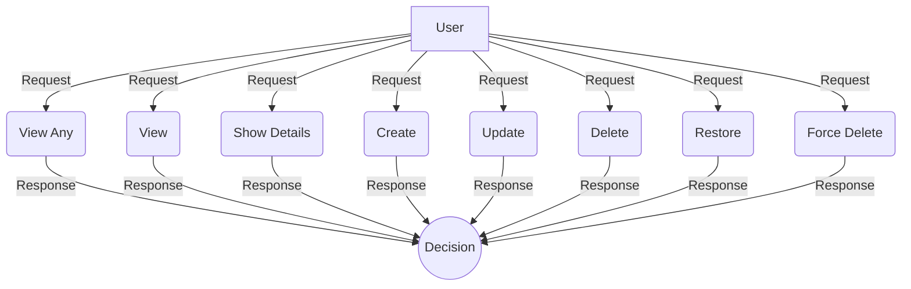

## Module: UserPolicy.php
Based on the provided code for the `UserPolicy.php` module, here is a comprehensive analysis:

- **Module Name**: UserPolicy

- **Primary Objectives**: The primary purpose of this module is to define authorization policies for different actions that can be performed on the `User` model within an application. It aims to control what authenticated users can or cannot do with respect to viewing, creating, updating, or deleting user records, based on their permissions.

- **Critical Functions**:
  - `viewAny(User $user)`: Determines if the user can view any user models.
  - `view(User $user)`: Determines if the user can view a specific user model. (Currently, this method always returns true but is intended to check permissions).
  - `showDetails(User $user)`: Determines if the user can view detailed information about a user model.
  - `create(User $user)`: Determines if the user can create a new user model.
  - `update(User $user, User $model)`: Determines if the user can update a specific user model.
  - `delete(User $user, User $model)`: Determines if the user can delete a specific user model.
  - `restore(User $user, User $model)`: Determines if the user can restore a specific user model.
  - `forceDelete(User $user, User $model)`: Determines if the user can permanently delete a specific user model.

- **Key Variables**:
  - `$user`: Represents the authenticated user attempting to perform an action.
  - `$model`: Represents the user model that is the target of an action (in methods where applicable).

- **Interdependencies**:
  - This module interacts with the `User` model to check permissions and make decisions based on the authenticated user's abilities.
  - It also depends on Laravel's authorization features, such as `HandlesAuthorization`.

- **Core vs. Auxiliary Operations**:
  - Core Operations: `viewAny`, `create`, `update`, `delete`, `restore`, and `forceDelete` methods are core to managing user access and permissions.
  - Auxiliary Operations: `view` and `showDetails` could be considered auxiliary, providing additional granularity for read operations.

- **Operational Sequence**:
  - Typically, an operational sequence would start with the `viewAny` or `view` methods to check read permissions, followed by `create`, `update`, or `delete` based on user actions. The `restore` and `forceDelete` methods are specific to scenarios involving soft deleted models.

- **Performance Aspects**:
  - Performance considerations include efficient permission checks to ensure minimal impact on response times. Caching user permissions could be beneficial in reducing database queries.

- **Reusability**:
  - The module is designed for reuse within the application it serves, especially as it follows a common pattern for defining policies in Laravel applications. It can be adapted or extended for other models with similar authorization requirements.

- **Usage**:
  - This policy is used to authorize user actions within the application, typically by being registered in the `AuthServiceProvider` and then referenced in controllers or middleware to protect routes.

- **Assumptions**:
  - The module assumes that the `User` model has a method `can` that checks if a user has a specific permission (e.g., 'Read User').
  - It assumes that permissions like 'Read User', 'Create User', etc., are predefined and assigned to users.
  - The code comments and `die` statements suggest it's under development or for demonstration, assuming further implementation will replace these placeholders.
## Flow Diagram [via mermaid]

