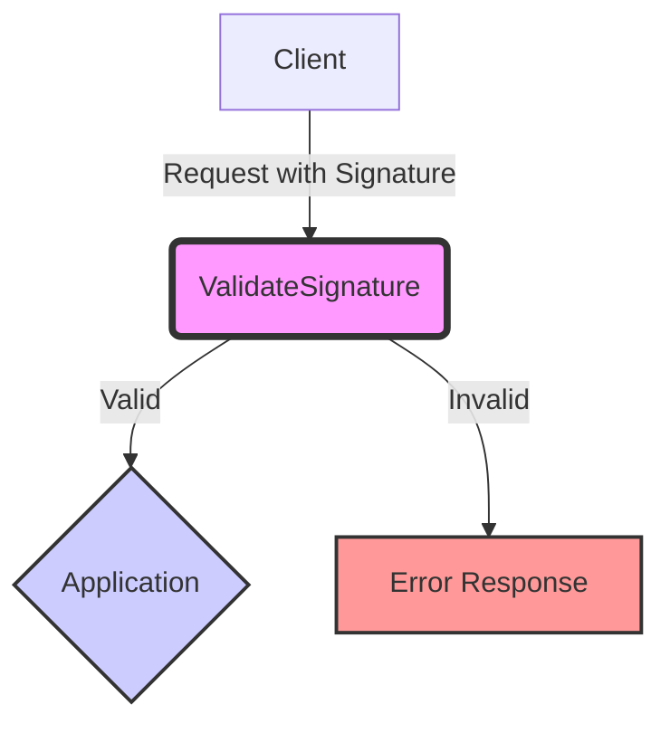

## Module: ValidateSignature.php
Based on the provided code snippet, here is a comprehensive analysis of the `ValidateSignature.php` module:

### Module Name
The module is named `ValidateSignature`.

### Primary Objectives
Its primary purpose is to serve as a middleware in a web application, specifically to validate the signature of incoming requests to ensure they are from a trusted source. This is crucial for security, as it helps prevent unauthorized access and tampering with requests.

### Critical Functions
Since the provided code is a class definition extending a base middleware class (`Illuminate\Routing\Middleware\ValidateSignature`), the critical functions would be inherited from the parent class. These would typically include methods for validating the signature of requests. However, the specific functions are not directly visible in the provided snippet.

### Key Variables
- `$except`: An array of query string parameters that should be ignored by the signature validation process. This could be useful for excluding parameters that are known to change or are uncontrollable, such as those added by third-party services (e.g., Facebook, Google UTM parameters).

### Interdependencies
This module depends on the Laravel framework, specifically its middleware and routing components. It extends `Illuminate\Routing\Middleware\ValidateSignature`, indicating a direct inheritance relationship.

### Core vs. Auxiliary Operations
- **Core Operations**: The core operation of this middleware is the validation of request signatures.
- **Auxiliary Operations**: Managing the list of query string parameters to ignore during validation (`$except` array) can be considered an auxiliary operation, as it supports the primary validation function by customizing its behavior.

### Operational Sequence
While the operational sequence is not explicitly detailed in the snippet, typically, middleware like this would:
1. Intercept incoming HTTP requests.
2. Validate the signature of the request based on predefined rules and parameters.
3. Proceed with the request if the validation is successful or reject it if not.

### Performance Aspects
Performance considerations would primarily involve the efficiency of the signature validation process, as it could add overhead to request processing. Optimizing the validation algorithm and minimizing the number of parameters to check (via the `$except` list) could help mitigate performance impacts.

### Reusability
The module is designed with reusability in mind, as it extends a generic Laravel middleware class. The use of an `$except` array to customize ignored parameters further enhances its adaptability to different applications and scenarios.

### Usage
This middleware would be used in a Laravel application to secure routes by ensuring that only requests with a valid signature are processed. It would typically be registered in the application's middleware stack, often globally or on specific routes requiring signature validation.

### Assumptions
- The module assumes that the application uses Laravel's routing and middleware system.
- It assumes that there is a need to exclude certain query parameters from signature validation, likely due to their dynamic nature or because they are added by external sources.
- It assumes the presence of a mechanism (inherited from the base middleware class) to validate signatures according to a specific algorithm or set of rules.
## Flow Diagram [via mermaid]

