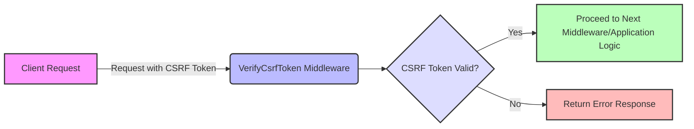

## Module: VerifyCsrfToken.php
Without the actual implementation details of methods within the `VerifyCsrfToken` class, I'll provide an analysis based on standard practices and the typical functionality expected from a middleware component with such a name in a Laravel application.

### Module Name
The module is identified as `VerifyCsrfToken.php`.

### Primary Objectives
Its primary purpose is to handle Cross-Site Request Forgery (CSRF) protection for the application. It ensures that incoming requests to the application are from legitimate sources by checking for the presence of a valid CSRF token.

### Critical Functions
While the specific methods are not detailed in the provided snippet, a typical `VerifyCsrfToken` middleware would include:
- **handle($request, $next)**: The main method that intercepts incoming HTTP requests. It checks if the CSRF token in the request is valid before allowing the request to proceed.
- **addCookieToResponse($request, $response)**: Adds a CSRF token cookie to the HTTP response, ensuring that the client can submit this token with subsequent requests.

### Key Variables
- **$except**: An array that lists URIs which should be excluded from CSRF verification. This is crucial for endpoints that might not require CSRF protection, such as API routes intended for external access.

### Interdependencies
This middleware interacts with:
- **The HTTP request and response objects**: It examines requests for CSRF tokens and modifies responses to include CSRF tokens.
- **Session storage**: To verify the CSRF token against the one stored in the session.
- **Routing**: It can affect the routing logic by potentially aborting requests that do not have a valid CSRF token.

### Core vs. Auxiliary Operations
- **Core Operations**: Validating the CSRF token on incoming requests and aborting requests without a valid token.
- **Auxiliary Operations**: Excluding certain URIs from CSRF checks, adding CSRF tokens to responses.

### Operational Sequence
1. **Exclusion Check**: First, it checks if the incoming request URI matches any in the `$except` array. If so, the request is allowed to proceed without CSRF verification.
2. **Token Validation**: If the request is not excluded, it checks for a valid CSRF token.
3. **Request Handling**: Depending on the validation outcome, it either aborts the request (if the token is invalid or missing) or allows it to proceed to the next middleware or the intended controller.

### Performance Aspects
- **Efficiency**: Designed to be lightweight to minimize impact on request processing time.
- **Caching**: Does not directly involve caching, but improper handling or bypassing of CSRF checks could lead to security vulnerabilities.

### Reusability
The middleware is highly reusable across Laravel applications requiring CSRF protection. The `$except` array is easily configurable to adapt to different application requirements.

### Usage
It is automatically applied to all web routes in a Laravel application, except for those explicitly listed in the `$except` array. It is a critical component of the security layer in Laravel applications.

### Assumptions
- The application uses a session-based mechanism to store the CSRF token.
- Clients are responsible for including the CSRF token in requests, typically as a header or part of the request payload.
- Certain routes (e.g., APIs) might not require CSRF protection and thus can be listed in the `$except` array.

This analysis assumes standard functionality based on the Laravel framework's handling of CSRF protection. Actual implementation details might vary and would require a review of the complete class definition.
## Flow Diagram [via mermaid]

