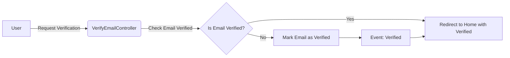

## Module: VerifyEmailController.php
Based on the provided code snippet, here is a comprehensive analysis of the `VerifyEmailController.php` module:

### Module Name
- `VerifyEmailController.php`

### Primary Objectives
- The main purpose of this module is to manage the email verification process for authenticated users within an application. It specifically handles marking a user's email as verified and redirecting appropriately after the verification process.

### Critical Functions
- `__invoke(EmailVerificationRequest $request): RedirectResponse`: This is the primary method of the controller. It checks if the user's email is already verified, marks the email as verified if it isn't already, and then redirects the user. It uses an `EmailVerificationRequest` to ensure this action is only taken for authenticated requests that are intended for email verification.

### Key Variables
- `$request`: This variable is an instance of `EmailVerificationRequest`, containing the user's verification request data.
- `RouteServiceProvider::HOME`: A route/URL to which the user is redirected after email verification.

### Interdependencies
- **Laravel Framework**: This module is built on the Laravel framework, relying on its routing, controller, and event systems.
- **`EmailVerificationRequest`**: It depends on this request class to ensure that only valid, authenticated verification requests are processed.
- **`Verified` Event**: This event is dispatched if the user successfully verifies their email.
- **`RouteServiceProvider`**: Utilizes this provider for determining the redirection path post-verification.

### Core vs. Auxiliary Operations
- **Core Operations**: Verifying the user's email and redirecting the user post-verification.
- **Auxiliary Operations**: Checking if the email is already verified to prevent unnecessary operations, and dispatching an event upon successful verification.

### Operational Sequence
1. The method checks if the user's email is already verified.
2. If not, it proceeds to mark the email as verified.
3. Dispatches the `Verified` event if the email was successfully marked as verified.
4. Redirects the user to a predetermined route with a verification status query parameter.

### Performance Aspects
- The module is designed to be efficient by first checking if an email is already verified to avoid unnecessary operations.
- Utilizing redirect responses and intended routes ensures a smooth user experience without significant delays.

### Reusability
- This controller is highly specific to email verification but can be adapted for similar verification processes (like phone number verification) with minimal changes.

### Usage
- It is used as part of the authentication process in a Laravel application, specifically after a user attempts to verify their email through a verification link.

### Assumptions
- The user is already authenticated and has a verification link.
- The application uses Laravel's built-in authentication and routing systems.
- `config('app.frontend_url')` is properly set to the application's frontend URL in the configuration files.
- `RouteServiceProvider::HOME` is defined and points to a valid route within the application.

This analysis covers the primary aspects of the `VerifyEmailController.php` module, highlighting its role in handling email verification within a Laravel-based application.
## Flow Diagram [via mermaid]

