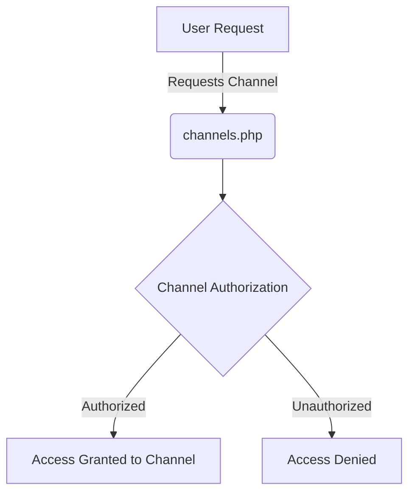

## Module: channels.php
Given the provided code snippet, let's break down the analysis as requested:

### Module Name
The module is identified as `channels.php`.

### Primary Objectives
The primary purpose of this module is to register event broadcasting channels within a Laravel application. It specifies how channels are authorized, determining which users can listen to which events based on their authentication status and identity.

### Critical Functions
- `Broadcast::channel`: This is the main method used in the module. Its role is to register a broadcasting channel and define an authorization callback that checks if a user is authorized to listen to the channel.

### Key Variables
- `$user`: Represents the currently authenticated user trying to listen to the channel.
- `$id`: The identifier that is being checked against the user's ID to authorize access to the channel.

### Interdependencies
This module depends on the Laravel broadcasting system and the authentication system to function correctly. It uses the `Broadcast` facade from `Illuminate\Support\Facades\Broadcast` and interacts with user authentication to verify identities.

### Core vs. Auxiliary Operations
- **Core Operations**: The core operation is the registration and authorization of broadcasting channels using `Broadcast::channel`.
- **Auxiliary Operations**: There are no explicit auxiliary operations within this snippet, but auxiliary operations might include logging, event handling, or additional channel configuration not shown here.

### Operational Sequence
1. The module imports necessary dependencies.
2. It then defines a broadcasting channel named `App.Models.User.{id}`.
3. The authorization callback is defined, which checks if the authenticated user's ID matches the ID specified in the channel name.

### Performance Aspects
Performance considerations include the efficiency of the authorization callback. Since the callback performs a type-safe comparison between the user ID and the channel ID, it should be relatively fast. However, performance could be impacted if there are a large number of concurrent authorization requests.

### Reusability
The module demonstrates a pattern for registering and authorizing broadcasting channels that can be easily adapted for other types of channels within the application. The use of parameterized channel names and callbacks for authorization checks offers a flexible template for reuse.

### Usage
This module is used in the context of setting up real-time, event-driven communication in a Laravel application. Specifically, it's part of configuring which users can subscribe to updates about specific models (in this case, `User` models) based on their IDs.

### Assumptions
- The module assumes that the Laravel broadcasting and authentication systems are properly set up and functioning.
- It assumes that `$user->id` correctly identifies the authenticated user.
- There's an assumption that user IDs are integers, as evidenced by the type casting in the comparison.

This analysis breaks down the purpose, functionality, and considerations of the `channels.php` module within the context of a Laravel application's event broadcasting setup.
## Flow Diagram [via mermaid]

