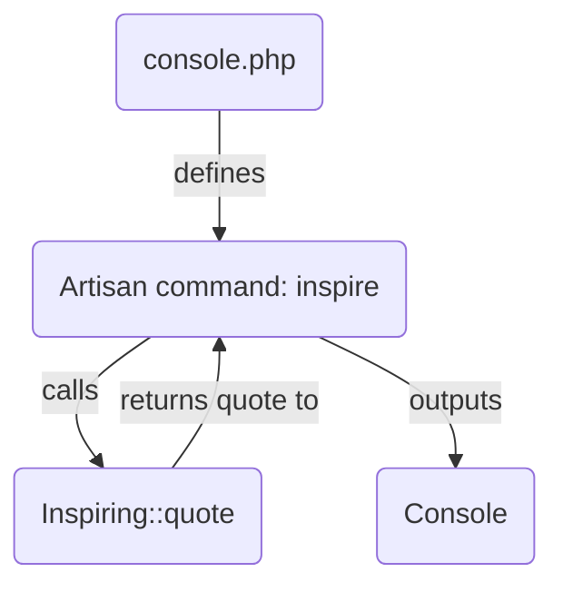

## Module: console.php
Based on the provided code snippet, here's a comprehensive analysis of the module:

- **Module Name**: The module is named `console.php`.

- **Primary Objectives**: The primary purpose of this module is to define Closure-based console commands within a Laravel application. It serves as a central place for the registration and handling of custom console commands.

- **Critical Functions**:
  - `Artisan::command('inspire', function () {...})`: Registers a console command named `inspire` that, when executed, displays an inspiring quote. The Closure provided as the second argument defines the command's execution logic.
  - `$this->comment(Inspiring::quote())`: Within the Closure of the `inspire` command, this line outputs an inspiring quote to the console. It utilizes the `Inspiring::quote()` method to retrieve a quote and then formats it for console output using the `comment` method.

- **Key Variables**: There are no explicit variables defined within this short snippet; however, the implicit variable `$this` within the Closure refers to the command instance itself, allowing access to methods like `comment`.

- **Interdependencies**:
  - `Illuminate\Foundation\Inspiring`: This class is used to generate inspiring quotes. It's a dependency for the `inspire` command to function correctly.
  - `Illuminate\Support\Facades\Artisan`: Facilitates the registration and management of console commands within a Laravel application.

- **Core vs. Auxiliary Operations**:
  - **Core Operations**: The core operation of this module is the registration and execution of the `inspire` console command.
  - **Auxiliary Operations**: Retrieving and displaying an inspiring quote can be considered an auxiliary operation, supporting the primary objective of demonstrating how to create a custom console command.

- **Operational Sequence**: The sequence involves invoking the `inspire` command from the console, which then executes the Closure associated with it, resulting in an inspiring quote being displayed.

- **Performance Aspects**: Given the simplicity of the `inspire` command, performance considerations are minimal. The operation is lightweight, involving a simple retrieval of a static string and displaying it in the console.

- **Reusability**: The pattern demonstrated in registering the `inspire` command is highly reusable for defining other custom console commands within a Laravel application. The approach of using Closures allows for quick and straightforward command creation.

- **Usage**: This module is used within a Laravel application to define custom console commands. Specifically, the `inspire` command can be executed by running `php artisan inspire` from the command line, which will display an inspiring quote.

- **Assumptions**:
  - It's assumed that the `Inspiring` class has a method `quote()` that returns a string.
  - The environment is configured correctly for running Laravel Artisan commands.
  - The user is familiar with the basics of Laravel and its console command structure.

This analysis highlights the simplicity and elegance of Laravel's approach to defining console commands, showcasing how easily additional functionality can be integrated into an application's command-line interface.
## Flow Diagram [via mermaid]

