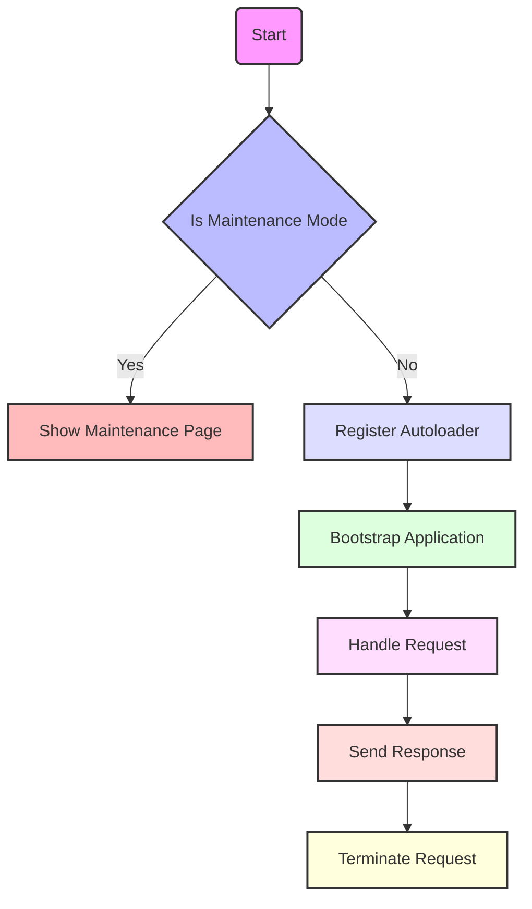

## Module: index.php
Based on the provided PHP code snippet, here's a comprehensive analysis:

- **Module Name**: The module can be identified as `index.php`.

- **Primary Objectives**: The primary purpose of this module is to bootstrap and handle a web request in a Laravel application. It serves as the entry point for all requests to the application.

- **Critical Functions**:
  - **Maintenance Mode Check**: Checks if the application is in maintenance mode and displays a pre-rendered page if it is.
  - **Auto Loader Registration**: Requires Composer's autoloader to ensure class auto-loading.
  - **Application Bootstrapping**: Initializes the Laravel application by requiring the `bootstrap/app.php` file.
  - **Handle Incoming Request**: Creates and handles an incoming HTTP request through the application's HTTP kernel.
  - **Terminate Request**: Cleans up after the response has been sent to the client.

- **Key Variables**:
  - `$app`: Represents the Laravel application instance.
  - `$kernel`: Represents the HTTP kernel instance.
  - `$response`: Holds the response generated for the incoming request.

- **Interdependencies**:
  - **Composer's Autoloader**: Relies on Composer for class loading.
  - **Laravel's Application Structure**: Depends on the Laravel framework's directory structure and bootstrap scripts.
  - **HTTP Kernel**: Interacts with the HTTP kernel for request handling.

- **Core vs. Auxiliary Operations**:
  - **Core Operations**: Bootstrapping the application, handling the request through the HTTP kernel, and sending the response.
  - **Auxiliary Operations**: Checking for maintenance mode and requiring the Composer autoloader.

- **Operational Sequence**:
  1. Check for maintenance mode.
  2. Register Composer's autoloader.
  3. Bootstrap the Laravel application.
  4. Make the HTTP kernel.
  5. Handle the incoming request and send the response.
  6. Terminate the request.

- **Performance Aspects**:
  - Efficiency in bootstrapping and handling requests is crucial for minimizing response times.
  - Maintenance mode check should be lightweight to not impact performance negatively.

- **Reusability**:
  - The structure is specific to Laravel-based applications but the pattern of bootstrapping, handling, and terminating can serve as a reference for similar web application architectures.

- **Usage**:
  - This module is used as the entry point for all HTTP requests to a Laravel application. It's automatically called by the web server for every request due to the typical configuration of web servers to direct traffic to `index.php`.

- **Assumptions**:
  - The application is built with Laravel and follows its conventional directory structure.
  - Composer is used for dependency management.
  - The server is configured to redirect all HTTP requests to this `index.php` file.

This analysis outlines the module's role within a Laravel application, highlighting its functions, dependencies, and operational flow, emphasizing its importance in request handling and application lifecycle management.
## Flow Diagram [via mermaid]

