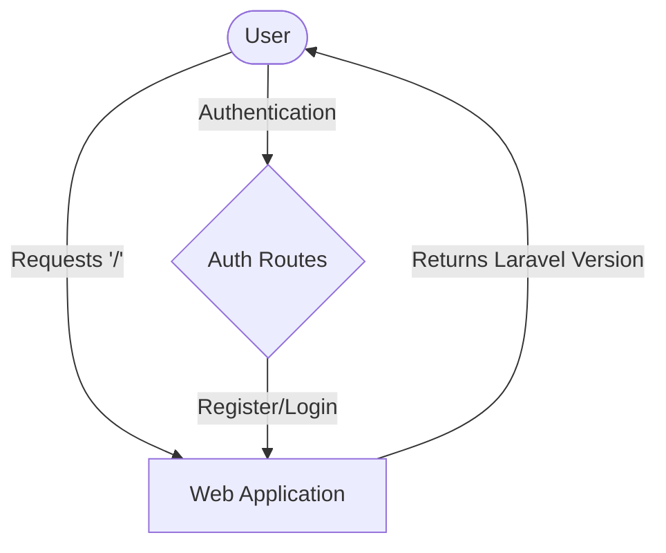

## Module: web.php
Based on the provided code snippet, here is a comprehensive analysis of the module:

### Module Name
The module is identified as `web.php`.

### Primary Objectives
The primary purpose of this module is to define web routes for a Laravel application. It serves as the central place to register all the web-facing routes, which are then loaded by the RouteServiceProvider within a group that contains the "web" middleware group.

### Critical Functions
- `Route::get('/'...)`: This is the main method in this module, defining a GET route for the application's root URL. When accessed, it returns the current Laravel version of the application as a JSON response.

### Key Variables
- `Route`: This is an essential facade provided by Laravel that allows defining routes in the application.

### Interdependencies
- `RouteServiceProvider`: This module depends on the RouteServiceProvider to load its routes into the application.
- `auth.php`: The module explicitly requires another route definition file, `auth.php`, indicating that it has routes related to authentication that are separated for organization and clarity.

### Core vs. Auxiliary Operations
- **Core Operations**: The core operation in this module is the definition of web routes, particularly the root route which returns the application version.
- **Auxiliary Operations**: Including the `auth.php` file can be considered an auxiliary operation, as it separates the authentication routes from the main web routes for better organization.

### Operational Sequence
The sequence is relatively straightforward:
1. The module defines a GET route for the application's root URL.
2. It then includes the `auth.php` file, which likely contains authentication-related routes.

### Performance Aspects
- The performance impact of this module is minimal, as route definitions are typically lightweight. However, the efficiency of the routes themselves depends on the complexity of the logic within their callbacks or controllers.

### Reusability
- The structure of the `web.php` file allows for easy reuse and extension. New routes can be added simply by defining new `Route` method calls. The separation of authentication routes into `auth.php` also exemplifies a reusable and modular approach to route management.

### Usage
- This module is used every time a web request is made to the application. Laravel's routing mechanism will match the request to the defined routes in this file and execute the corresponding logic.

### Assumptions
- It assumes that the Laravel application uses the "web" middleware group for its routes, which typically includes session state, CSRF protection, and more, making it suitable for web applications.
- It assumes that the application's routing needs are divided into general web routes and authentication-specific routes, as indicated by the inclusion of `auth.php`.
- There's an implicit assumption that the developer is familiar with Laravel's routing conventions and the structure of route definition files.

This analysis covers the primary aspects of the `web.php` module within a Laravel application, highlighting its purpose, structure, and usage within the broader context of web application development.
## Flow Diagram [via mermaid]

